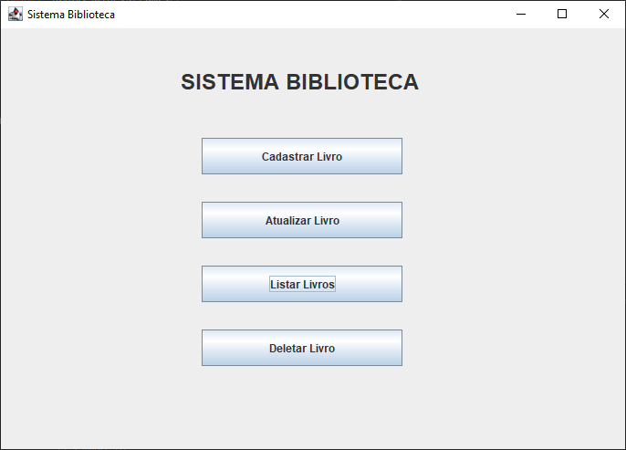
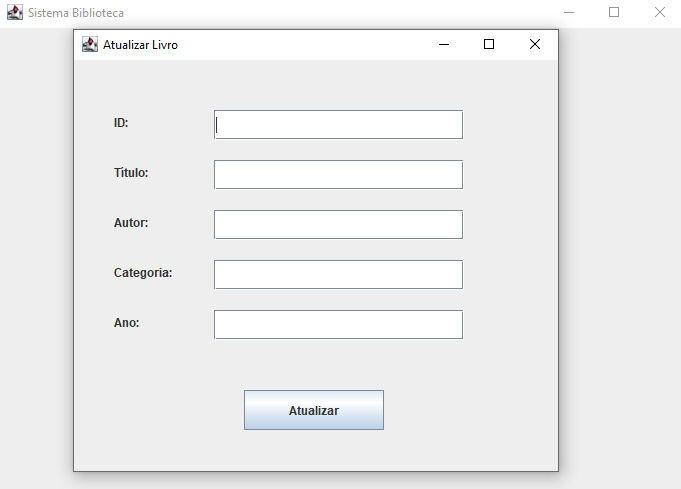
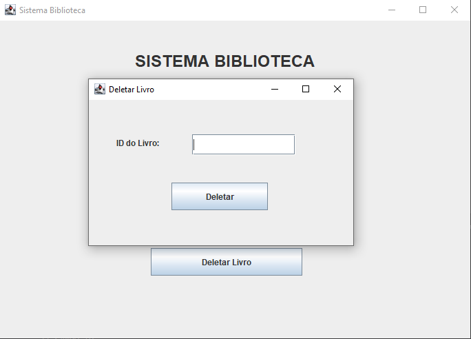
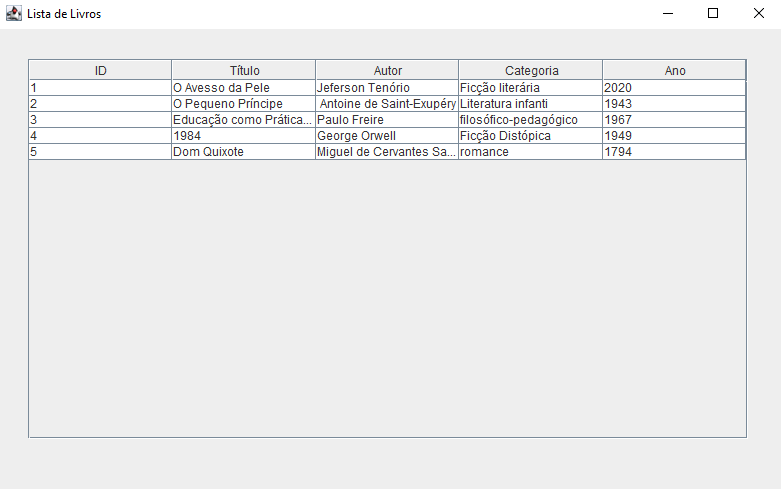
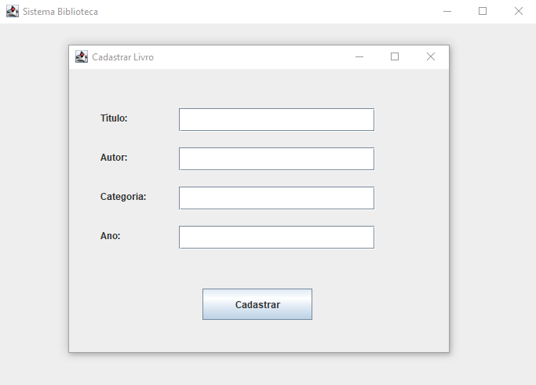

# Sistema Biblioteca

Sistema desktop CRUD desenvolvido em Java utilizando Swing, JDBC e MySQL.

## Funcionalidades

- Cadastro de livros
- Atualização de livros
- Listagem de livros
- Deleção de livros

## Tecnologias utilizadas

- Java
- Java Swing
- JDBC
- MySQL
- Eclipse IDE

## Estrutura do projeto

```txt
application
dao
database
model
view
```

## Screenshots

### Tela Principal


### Atualizar Livro


### Deletar Livro


### Lista de Livros


### Cadastro de Livros


## Autor

Juan Marinho Costa
